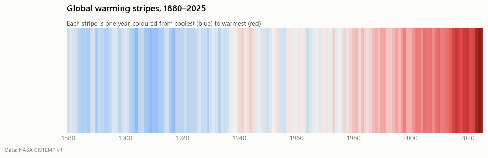
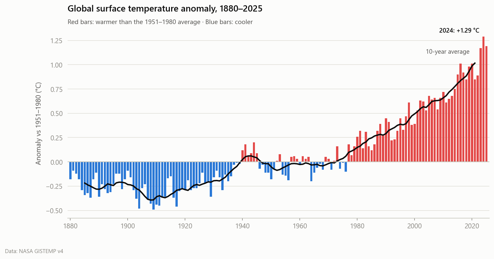
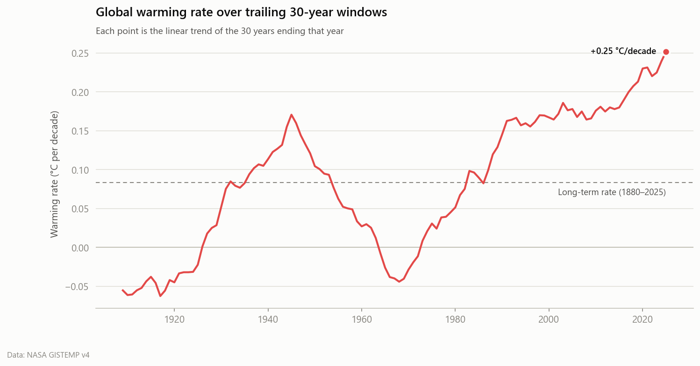
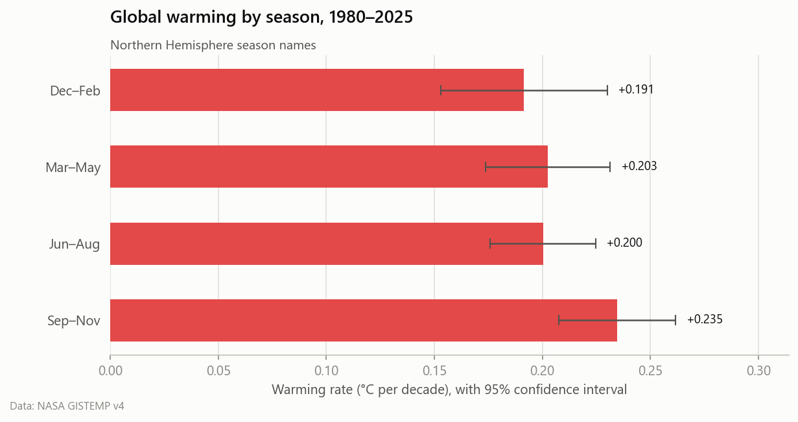
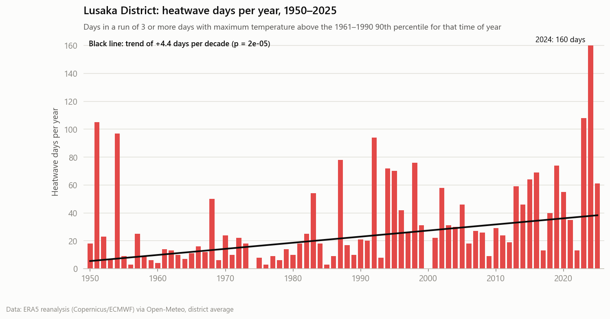
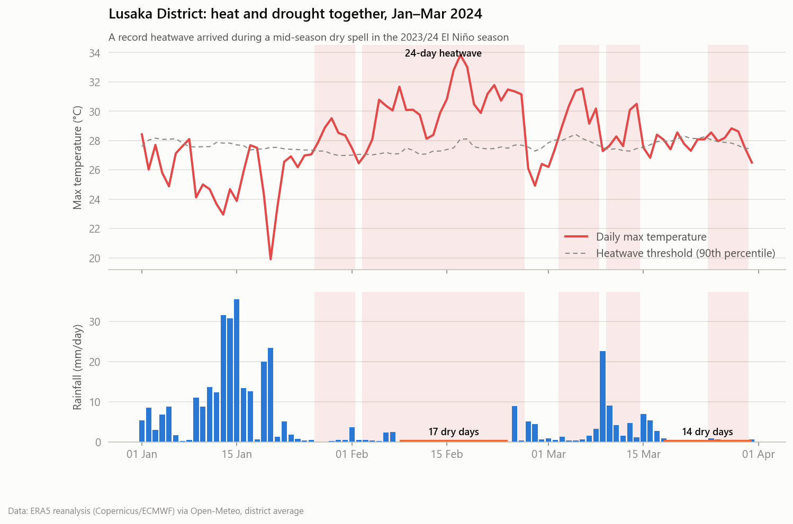
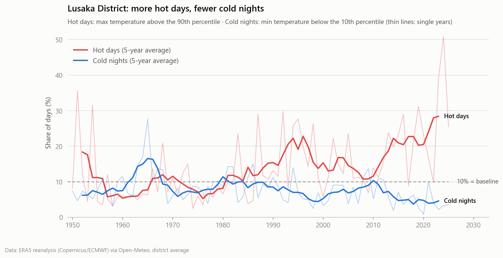
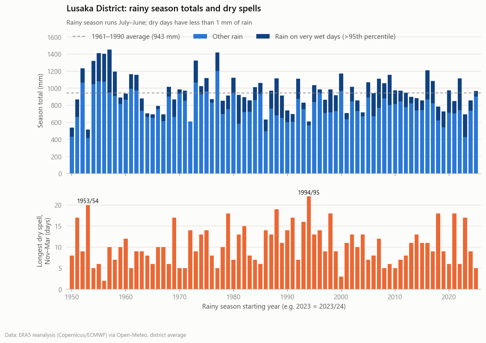
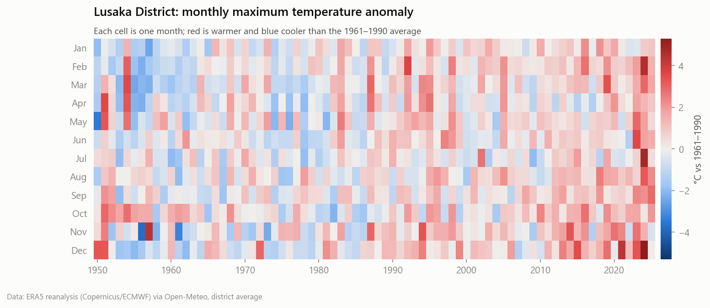

# Climate Modelling Scripts

Python tools that turn public climate datasets into clear, quantified insights.
Each analysis downloads freely available public data, runs reproducible statistics, and
produces publication-style figures along with a plain-English summary.



## Analyses

| # | Analysis | Data |
|---|---|---|
| 1 | [Temperature trends](#1-temperature-trends) | NASA GISTEMP v4 |
| 2 | [Extreme weather events: Lusaka District, Zambia](#2-extreme-weather-events--lusaka-district-zambia) | ERA5 reanalysis |
| 3 | [Zambia in 3D: the shape of the plateau](#3-zambia-in-3d--the-shape-of-the-plateau) | SRTM terrain (Terrain Tiles on AWS) |
| 4 | Drought analysis (SPI) | CHIRPS |
| 5 | CMIP6 future projections | CMIP6 |

---

## 1. Temperature trends

**Question:** How much has the planet warmed, and is the warming speeding up?

### Key findings (global, 1880–2025)

- The last decade was **+1.24 °C** warmer than 1880–1900, a common stand-in for pre-industrial levels.
- Warming since 1980 runs at **+0.21 °C per decade**, 2.5× the long-term rate of +0.08 °C per decade.
- Piecewise regression places the **acceleration point in 1975**. After it, warming is 5.6× faster than before.
- The latest 30-year warming rate (**+0.25 °C/decade**) is the highest in the record.
- **9 of the 10 warmest years** have all happened in the last decade. 2024 is the warmest year on record.
- The Northern Hemisphere is warming about **2.6× faster** than the Southern Hemisphere since 1980
  (+0.30 vs +0.12 °C/decade), because land warms faster than ocean.

Full reports with tables: [Global](outputs/global/summary.md) ·
[Northern Hemisphere](outputs/north/summary.md) · [Southern Hemisphere](outputs/south/summary.md)





### Methods

| Step | Method |
|---|---|
| Annual anomalies | GISTEMP January–December means, relative to 1951–1980. Incomplete years are dropped. |
| Trend | Ordinary least-squares regression with 95% confidence interval (t-distribution) |
| Acceleration | Continuous piecewise (hinge) regression. The breakpoint year is chosen by grid search to minimise squared error. |
| Warming rate over time | Linear trend of each trailing 30-year window |
| Smoothing | Centred 10-year rolling mean |
| Seasonal trends | OLS on the DJF / MAM / JJA / SON means since 1980 |

---

## 2. Extreme weather events — Lusaka District, Zambia

**Question:** Are heatwaves, heavy rain and dry spells in Lusaka changing?

Daily maximum and minimum temperature and rainfall (1950–2026) come from the public
**ERA5 reanalysis** and are averaged over the grid cells covering Lusaka District.

### Key findings

- **Heatwave days have increased 2.5×.** They averaged 17 per year in 1961–1990 and 44 per year in 1996–2025
  (trend +4.4 days per decade, p < 0.001).
- **2024 was exceptional:** 51% of days were "hot days" (the baseline expectation is 10%), with 160 heatwave days.
- **Cold nights are becoming rarer**, falling from 10% to 6% of nights. The hottest day of the year is warming by
  +0.2 °C per decade.
- **Heat and drought hit together in February 2024.** During the El Niño season, a 24-day heatwave overlapped a
  17-day mid-season dry spell, a combination especially damaging for maize.
- **Rainfall totals show no significant trend** (about 945 mm per season). Rain on very wet days rose 22%, which hints
  at heavier downpours, but that trend is not yet statistically significant.

Full report with trend tables and limitations: [Lusaka summary](outputs/lusaka/summary.md)







### Methods

| Index | Definition |
|---|---|
| Hot days / cold nights (TX90p, TN10p) | Share of days above the 90th (Tmax) or below the 10th (Tmin) calendar-day percentile of 1961–1990, using a 5-day window |
| Heatwave | 3 or more consecutive days above the Tmax 90th percentile |
| Rx1day, Rx5day, R20mm, R95pTOT | Wettest 1-day and 5-day totals, heavy-rain days (≥ 20 mm), and rain on very wet days (> 95th percentile) |
| Longest dry spell | Most consecutive days with < 1 mm of rain between November and March |
| Onset of rains | First day from 1 October with ≥ 20 mm over 3 days and no 10-day dry spell in the following 30 days |
| Trends | Theil–Sen slope with a Mann–Kendall significance test (robust to outliers) |

The rainy season runs July–June, so "2023/24" covers July 2023 to June 2024.

---

## 3. Zambia in 3D — the shape of the plateau

**Question:** How high is Zambia, and where does the land fall away?

Elevation from public SRTM-based terrain tiles is reprojected to an equal-area grid, so every cell
covers the same ground area. The 3D view is path-traced on the GPU with
[forge3d](https://github.com/milos-agathon/forge3d).


### Key findings

- **Zambia is a high plateau.** 82% of its 751,000 km² lies above 1,000 m, and the median height is 1,146 m.
  Nearly three-quarters of the country (74%) sits in a single 400 m band, 1,000–1,400 m.
- **Highest ground is 2,305 m** in the Mafinga Hills on the Malawi border. **The lowest is 329 m**, where the
  Luangwa joins the Zambezi.
- **Only 4% of the country lies below 600 m**, all of it in the Luangwa and middle Zambezi rift valleys.
- **The Luangwa rift drops 827 m in about 28 km**, from the crest of the Muchinga Escarpment to the valley floor.
- **Lusaka sits at about 1,280 m**, part of the reason the capital is cooler than its latitude suggests.

Full report with tables: [Zambia terrain summary](outputs/zambia/summary.md)


### Methods

| Step | Method |
|---|---|
| Elevation | Terrarium tiles at zoom 8 (about 600 m), mosaicked and reprojected bilinearly to a 600 m Lambert azimuthal equal-area grid |
| Cleaning | Spikes and stripe artefacts are replaced with the local median when they depart from it by more than 4× the local median absolute deviation (1% of cells) |
| Country area | geoBoundaries outline rasterised on the same grid. The result (751,142 km²) is within 0.2% of the official 752,618 km² |
| 3D render | 1.2 km heightmap, 25× vertical exaggeration, 64 path-traced samples per pixel, sun from the north-west |
| Overlays | Rivers, lakes and labels are projected onto the render with the same pinhole camera model, validated against forge3d to within about one pixel |

The GPU render needs `forge3d` and a GPU with Vulkan, DirectX 12 or Metal support (an integrated Intel GPU is enough).
Use `--no-render` to compute the statistics and charts without it.

---

## Getting started

```bash
git clone https://github.com/Fima41/Climate_modelling_Scripts.git
cd Climate_modelling_Scripts
pip install -r requirements.txt

# Run the analysis (downloads data automatically on the first run)
python -m climate_analysis.temperature_trends --dataset global
python -m climate_analysis.temperature_trends --dataset all --refresh   # all regions, latest data
python -m climate_analysis.extreme_events --district lusaka
python -m climate_analysis.terrain_3d --country zambia                # 3D poster, about 1 minute on a laptop GPU
python -m climate_analysis.terrain_3d --country zambia --no-render    # statistics and charts only

# Run the tests
python -m pytest
```

Options: `--dataset {global,north,south,all}`, `--refresh` (re-download), `--data-dir`, `--out-dir`.

## Project structure

```
climate_analysis/
├── data.py                 # Download and parse NASA GISTEMP tables
├── trends.py               # Trend, breakpoint, rolling-rate statistics
├── plots.py                # Figure styling and chart functions
├── temperature_trends.py   # Analysis 1: temperature trends
├── era5.py                 # Download district-average ERA5 daily data
├── indices.py              # Extreme-event indices (heatwaves, dry spells, rain onset)
├── extreme_plots.py        # Figures for the extremes analysis
├── extreme_events.py       # Analysis 2: extreme weather events
├── terrain.py              # Download and reproject elevation, borders, rivers and lakes
├── render3d.py             # forge3d camera, projection and path-traced rendering
├── terrain_plots.py        # 3D poster composition and terrain charts
└── terrain_3d.py           # Analysis 3: Zambia in 3D
tests/                      # Unit tests on synthetic data with known answers
outputs/<region>/           # Generated figures and summary.md
```

## Data sources

All data are free and publicly available.

- GISTEMP Team, 2026: *GISS Surface Temperature Analysis (GISTEMP), version 4.*
  NASA Goddard Institute for Space Studies. https://data.giss.nasa.gov/gistemp/
- Hersbach, H. et al. (2020): *The ERA5 global reanalysis.* Q. J. R. Meteorol. Soc., 146, 1999–2049.
  Copernicus Climate Change Service. Accessed through the [Open-Meteo](https://open-meteo.com/)
  historical weather API (CC BY 4.0).

- Terrain Tiles on AWS (Registry of Open Data), Mapzen terrarium encoding, built from SRTM (NASA/USGS),
  GMTED2010 (USGS) and ETOPO1 (NOAA). https://registry.opendata.aws/terrain-tiles/
- Runfola, D. et al. (2020): *geoBoundaries: A global database of political administrative boundaries.*
  PLoS ONE 15(4). https://www.geoboundaries.org (CC BY 4.0)
- Natural Earth: free vector and raster map data. https://www.naturalearthdata.com (public domain)
- 3D rendering: [forge3d](https://github.com/milos-agathon/forge3d) (Apache-2.0 / MIT).

## License

MIT
