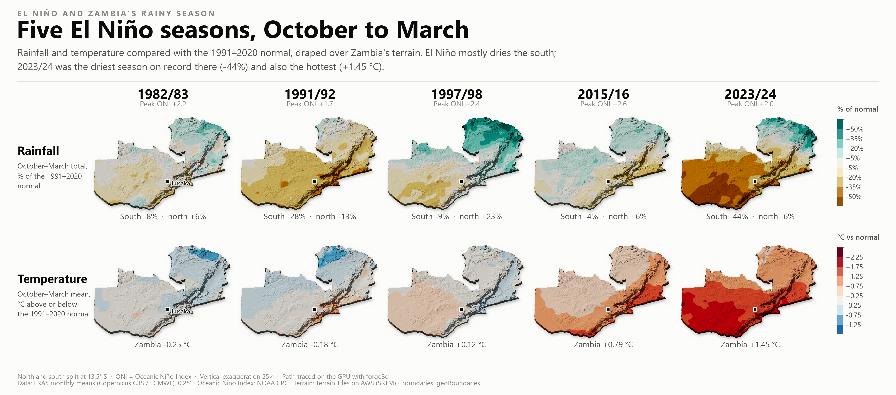
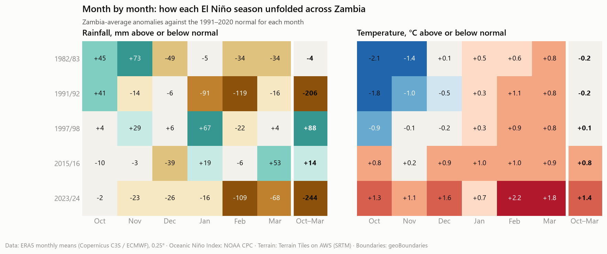
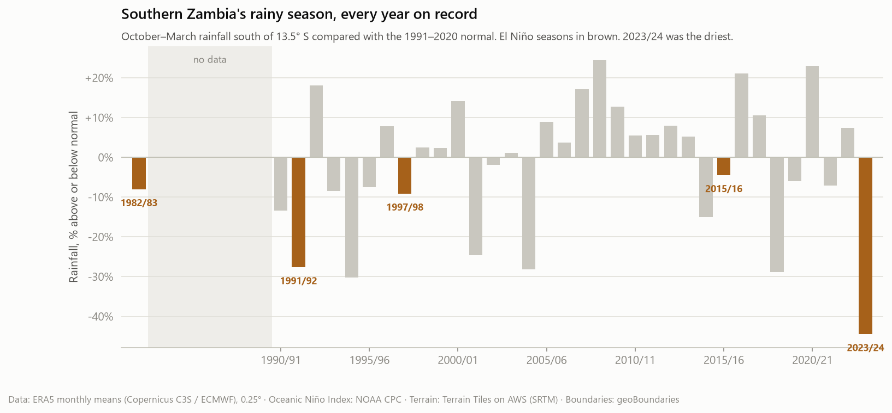

# El Niño and Zambia's rainy season (October–March)

Source: ERA5 monthly averaged reanalysis (Copernicus Climate Change Service / ECMWF) on a 0.25° grid (about 28 km), compared with the 1991–2020 normal (the 30 seasons from 1991/92 to 2020/21). Zambia averages weight each grid cell by the share of it inside the country and by its area. Southern Zambia means south of 13.5° S. The record covers 35 complete seasons: 1982/83 and 1990/91–2023/24.

## Key insights

- **El Niño mainly dries the south.** 5 of the 5 El Niño seasons were drier than normal in southern Zambia, by 19% on average. The north averaged +3%, so the El Niño signal shows up mainly in the south.
- **2023/24 was the driest season on record in the south**: -44% against normal, ranked 1 of 35. Zambia as a whole received 791 mm against a normal 1,035 mm (-24%).
- **The deficit concentrates in February**, the month maize needs most for grain filling. In the seasons that fell more than 100 mm short, February alone was 119 mm below normal in 1991/92 (58% of the shortfall) and 109 mm below normal in 2023/24 (45% of the shortfall). The February 2024 dry spell also stands out in the Lusaka analysis (analysis 2).
- **2023/24 was also the hottest**: +1.45 °C above normal across Zambia, ranked 1 of 35. Heat and drought together raise crop water stress beyond what the rainfall deficit alone suggests.
- **Not every El Niño brings drought.** In 1997/98, one of the strongest El Niños on record, the north was +23% wetter than normal and Zambia overall +8%. El Niño shifts the odds towards a dry south; it does not guarantee one.
- **Drought also comes without El Niño.** Of the five driest southern seasons on record (2023/24, 1994/95, 2018/19, 2004/05, 1991/92), 3 were not El Niño seasons: 1994/95, 2018/19, 2004/05.
- **Recent El Niños are warmer.** The two most recent seasons, 2015/16 and 2023/24, were the warmest of the five (+0.79 and +1.45 °C), while the earlier three were within about 0.25 °C of normal, consistent with the long-term warming trend in analysis 1.

## El Niño seasons

| Season | Peak ONI | Rain, Zambia | Rain, north | Rain, south | South rank (1 = driest) | Temperature | Temp rank (1 = hottest) |
|---|---:|---:|---:|---:|---:|---:|---:|
| 1982/83 | +2.2 | 0% | +6% | -8% | 11 of 35 | -0.25 °C | 29 of 35 |
| 1991/92 | +1.7 | -20% | -13% | -28% | 5 of 35 | -0.18 °C | 28 of 35 |
| 1997/98 | +2.4 | +8% | +23% | -9% | 9 of 35 | +0.12 °C | 8 of 35 |
| 2015/16 | +2.6 | +1% | +6% | -4% | 15 of 35 | +0.79 °C | 2 of 35 |
| 2023/24 | +2.0 | -24% | -6% | -44% | 1 of 35 | +1.45 °C | 1 of 35 |

Normal October–March rainfall is 1,035 mm for Zambia (1,119 mm in the north, 949 mm in the south), and the normal mean temperature is 23.4 °C.

## Month by month (Zambia average, difference from the monthly normal)

| Season | Oct | Nov | Dec | Jan | Feb | Mar |
|---|---:|---:|---:|---:|---:|---:|
| 1982/83 rain | +45 mm | +73 mm | -49 mm | -5 mm | -34 mm | -34 mm |
| 1991/92 rain | +41 mm | -14 mm | -6 mm | -91 mm | -119 mm | -16 mm |
| 1997/98 rain | +4 mm | +29 mm | +6 mm | +67 mm | -22 mm | +4 mm |
| 2015/16 rain | -10 mm | -3 mm | -39 mm | +19 mm | -6 mm | +53 mm |
| 2023/24 rain | -2 mm | -23 mm | -26 mm | -16 mm | -109 mm | -68 mm |
| 1982/83 temp | -2.1 °C | -1.4 °C | +0.1 °C | +0.5 °C | +0.6 °C | +0.8 °C |
| 1991/92 temp | -1.8 °C | -1.0 °C | -0.5 °C | +0.3 °C | +1.1 °C | +0.8 °C |
| 1997/98 temp | -0.9 °C | -0.1 °C | -0.2 °C | +0.3 °C | +0.9 °C | +0.8 °C |
| 2015/16 temp | +0.8 °C | +0.2 °C | +0.9 °C | +1.0 °C | +1.0 °C | +0.9 °C |
| 2023/24 temp | +1.3 °C | +1.1 °C | +1.6 °C | +0.7 °C | +2.2 °C | +1.8 °C |

## Method

- Season rainfall is the sum of the six monthly totals (mean daily rate × days in month). Season temperature is the day-weighted mean of the monthly means.
- Rainfall anomalies are the season total as a percentage of the 1991–2020 mean; temperature anomalies are differences in °C. Area averages are taken before the ratio, so dry regions do not dominate.
- For the maps, the 0.25° anomalies are resampled bilinearly onto the 600 m terrain grid, grouped into classes and draped over the 3D terrain (25× vertical exaggeration), path-traced with forge3d.
- El Niño seasons and peak Oceanic Niño Index values follow NOAA's Climate Prediction Center.

## Limitations

- ERA5 is a reanalysis; its rainfall comes from the forecast model and is less reliable than its temperature. Satellite–gauge products such as CHIRPS (planned for analysis 4) are better for rainfall totals.
- The 0.25° grid smooths local rainfall; the maps show regional patterns, not individual farms.
- The 1991–2020 normal includes three of the El Niño seasons, as standard WMO normals do.
- Seasons 1983/84 to 1989/90 are not in the download, so ranks cover the available record only.
- El Niño is one of several drivers of Zambian rainfall (others include the Indian Ocean Dipole), so five events show tendencies, not certainties.

## Figures

