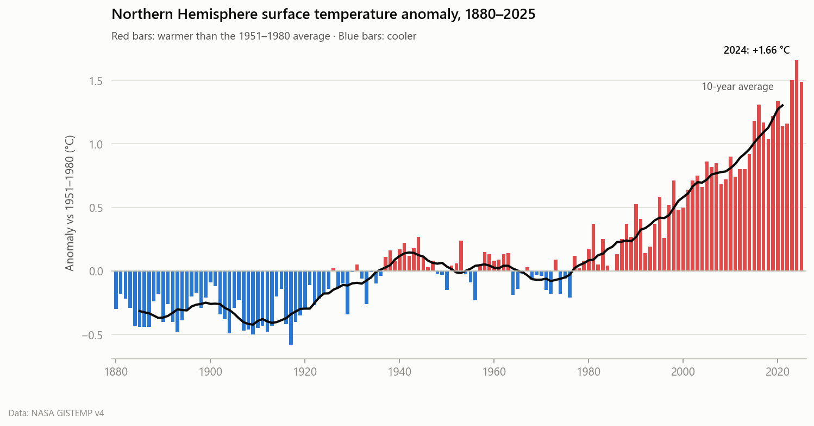
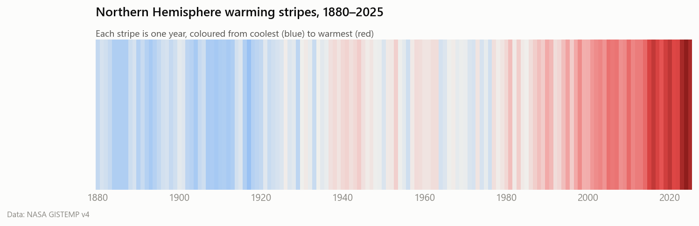
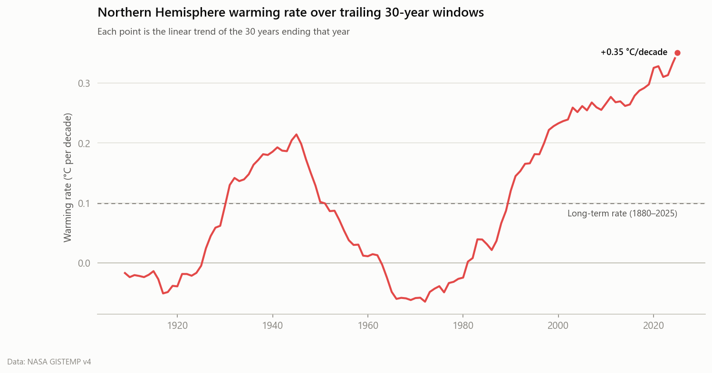
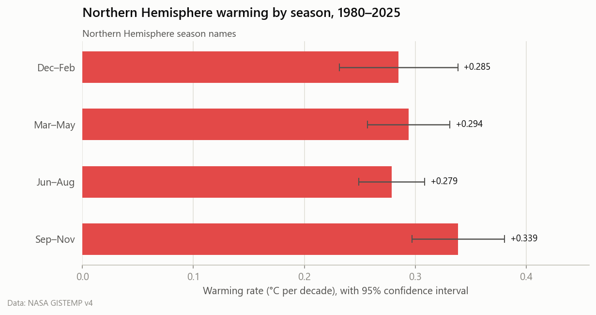

# Northern Hemisphere temperature trends (1880–2025)

Source: NASA GISTEMP v4. Anomalies are relative to the 1951-1980 mean.

## Key insights

- **+1.61 °C**: the last 10 years were this much warmer than 1880–1900, a common stand-in for pre-industrial levels.
- **Long-term rate:** +0.099 ± 0.010 °C per decade since 1880 (R² = 0.73, p = 2.9e-43).
- **Recent rate:** +0.300 ± 0.033 °C per decade since 1980, 3.0× the long-term rate.
- **Acceleration:** the best-fit breakpoint is **1985**. The rate went from +0.049 to +0.315 °C/decade (6.5× faster). The two-segment fit cuts squared error by 65% compared with a single line.
- **Latest 30-year rate:** +0.351 °C/decade for 1996–2025.
- **Record heat:** 9 of the 10 warmest years on record fall in the last decade. The warmest year is 2024 (+1.66 °C).
- **Fastest-warming season since 1980:** SON (+0.339 °C/decade).

## Ten warmest years

| Rank | Year | Anomaly (°C) |
|---:|---:|---:|
| 1 | 2024 | +1.66 |
| 2 | 2023 | +1.50 |
| 3 | 2025 | +1.49 |
| 4 | 2020 | +1.34 |
| 5 | 2016 | +1.31 |
| 6 | 2019 | +1.22 |
| 7 | 2015 | +1.18 |
| 8 | 2017 | +1.17 |
| 9 | 2022 | +1.16 |
| 10 | 2021 | +1.14 |

## Decade averages

| Decade | Mean anomaly (°C) | Change from previous decade (°C) |
|---|---:|---:|
| 1880s | -0.32 | – |
| 1890s | -0.31 | +0.01 |
| 1900s | -0.34 | -0.03 |
| 1910s | -0.39 | -0.05 |
| 1920s | -0.18 | +0.21 |
| 1930s | -0.01 | +0.17 |
| 1940s | +0.11 | +0.12 |
| 1950s | +0.02 | -0.10 |
| 1960s | +0.00 | -0.02 |
| 1970s | -0.05 | -0.05 |
| 1980s | +0.19 | +0.24 |
| 1990s | +0.42 | +0.23 |
| 2000s | +0.72 | +0.30 |
| 2010s | +1.01 | +0.29 |

## Figures

