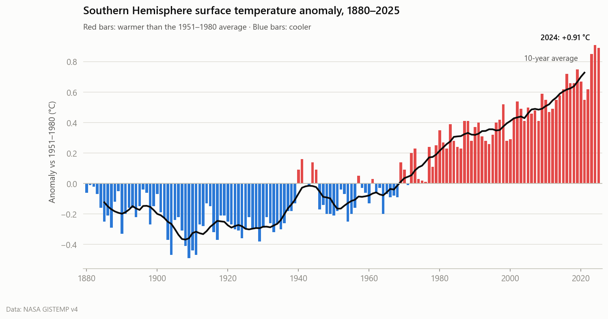
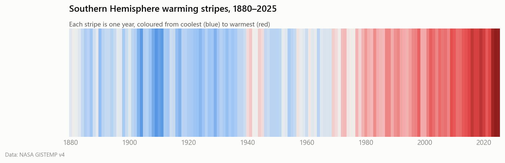
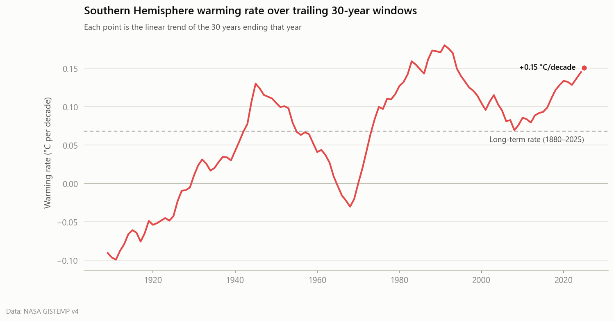
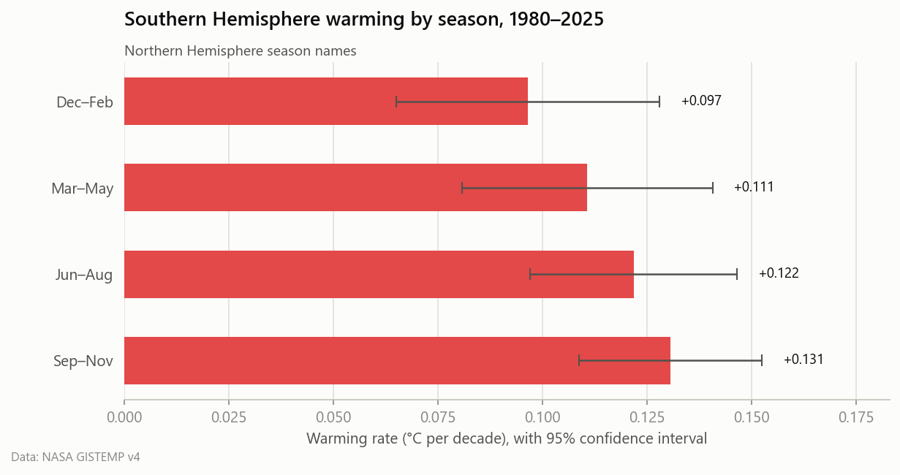

# Southern Hemisphere temperature trends (1880–2025)

Source: NASA GISTEMP v4. Anomalies are relative to the 1951-1980 mean.

## Key insights

- **+0.87 °C**: the last 10 years were this much warmer than 1880–1900, a common stand-in for pre-industrial levels.
- **Long-term rate:** +0.068 ± 0.007 °C per decade since 1880 (R² = 0.74, p = 1.4e-43).
- **Recent rate:** +0.115 ± 0.020 °C per decade since 1980, 1.7× the long-term rate.
- **Acceleration:** the best-fit breakpoint is **1927**. The rate went from -0.046 to +0.106 °C/decade (a switch from flat or cooling to sustained warming). The two-segment fit cuts squared error by 59% compared with a single line.
- **Latest 30-year rate:** +0.151 °C/decade for 1996–2025.
- **Record heat:** 9 of the 10 warmest years on record fall in the last decade. The warmest year is 2024 (+0.91 °C).
- **Fastest-warming season since 1980:** SON (+0.131 °C/decade).

## Ten warmest years

| Rank | Year | Anomaly (°C) |
|---:|---:|---:|
| 1 | 2024 | +0.91 |
| 2 | 2025 | +0.89 |
| 3 | 2023 | +0.85 |
| 4 | 2019 | +0.75 |
| 5 | 2016 | +0.72 |
| 6 | 2020 | +0.67 |
| 7 | 2018 | +0.66 |
| 8 | 2017 | +0.66 |
| 9 | 2022 | +0.62 |
| 10 | 2015 | +0.62 |

## Decade averages

| Decade | Mean anomaly (°C) | Change from previous decade (°C) |
|---|---:|---:|
| 1880s | -0.12 | – |
| 1890s | -0.17 | -0.05 |
| 1900s | -0.30 | -0.13 |
| 1910s | -0.29 | +0.01 |
| 1920s | -0.30 | -0.01 |
| 1930s | -0.24 | +0.06 |
| 1940s | -0.02 | +0.22 |
| 1950s | -0.11 | -0.09 |
| 1960s | -0.06 | +0.06 |
| 1970s | +0.12 | +0.17 |
| 1980s | +0.31 | +0.19 |
| 1990s | +0.36 | +0.05 |
| 2000s | +0.46 | +0.10 |
| 2010s | +0.60 | +0.15 |

## Figures

