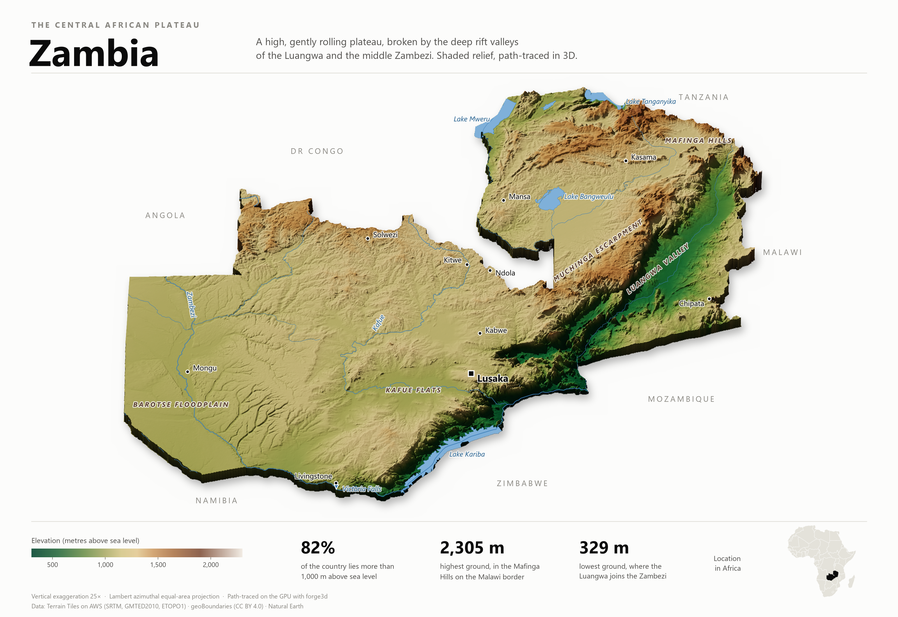
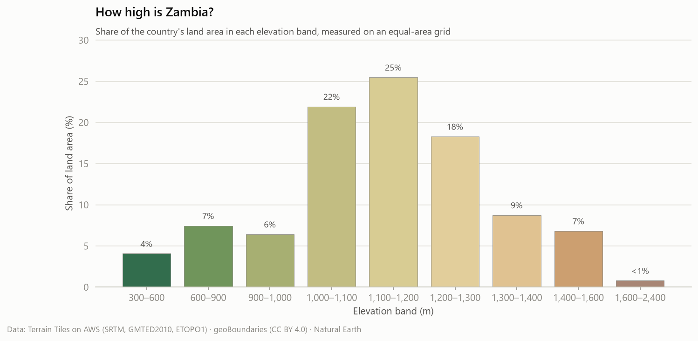
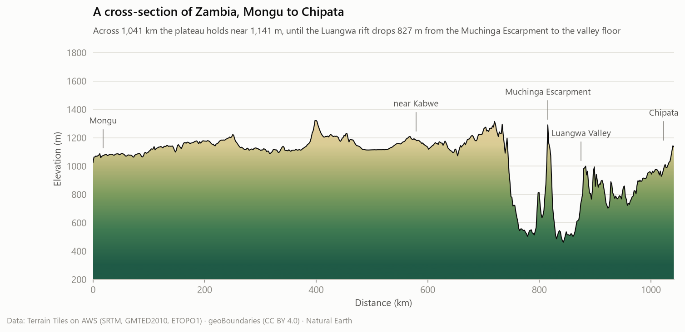

# The terrain of Zambia

Source: Terrain Tiles on AWS (Mapzen terrarium encoding; SRTM, GMTED2010 and ETOPO1), reprojected to a 600 m Lambert azimuthal equal-area grid. Country outline from geoBoundaries (gbOpen, CC BY 4.0); rivers, lakes and the locator map from Natural Earth.

## Key insights

- **Zambia is a high plateau.** 82% of its 751,142 km² lies above 1,000 m, and the median height is 1,146 m. 74% of the land sits in the 1,000–1,400 m band alone.
- **Highest ground: 2,305 m** in the Mafinga Hills on the Malawi border (9.95° S, 33.35° E). The surveyed summit is 2,339 m; the ~600 m grid smooths the peak.
- **Lowest ground: 329 m** where the Luangwa joins the Zambezi (15.61° S, 30.41° E). Only 4% of the country lies below 600 m, all of it in the Luangwa and middle Zambezi rift valleys.
- **The Luangwa rift** drops about 827 m on the Mongu–Chipata cross-section, from 1,291 m on the crest of the Muchinga Escarpment down to 464 m on the valley floor, within about 28 km.
- **Lusaka sits at about 1,281 m**, which helps explain why the capital is cooler than its latitude would suggest.

## Area by elevation band

| Elevation (m) | Share of land area |
|---|---:|
| 300–600 | 4.1% |
| 600–900 | 7.5% |
| 900–1,000 | 6.4% |
| 1,000–1,100 | 21.9% |
| 1,100–1,200 | 25.5% |
| 1,200–1,300 | 18.3% |
| 1,300–1,400 | 8.7% |
| 1,400–1,600 | 6.8% |
| 1,600–2,400 | 0.8% |

## Elevation of major towns

| Town | Elevation (m) |
|---|---:|
| Kasama | 1,395 |
| Solwezi | 1,370 |
| Ndola | 1,307 |
| Lusaka | 1,281 |
| Kitwe | 1,229 |
| Mansa | 1,209 |
| Kabwe | 1,191 |
| Chipata | 1,135 |
| Mongu | 1,026 |
| Livingstone | 960 |

## Method

- Terrarium tiles at zoom 8 (about 600 m per pixel at this latitude) are mosaicked and reprojected with bilinear resampling to an equal-area grid, so every cell covers the same ground area and area shares are exact.
- Isolated spikes, pits and stripe artefacts in the source mosaic are replaced with the local median when they depart from it by more than four times the local median absolute deviation (1% of cells). Genuine escarpments have a large local spread and are kept.
- The 3D view averages the grid to 1.2 km cells, exaggerates heights 25×, and is path-traced on the GPU with [forge3d](https://github.com/milos-agathon/forge3d) using a low north-west sun. Rivers, lakes and labels are projected onto the render with the same camera model.

## Limitations

- SRTM is a surface model: dense forest canopy can add a few metres, and summits are smoothed by the grid spacing.
- Town elevations are sampled at the town centre on the 600 m grid, so they are approximate.
- Rivers and lakes come from Natural Earth at 1:10 million scale and are generalised.

## Figures

